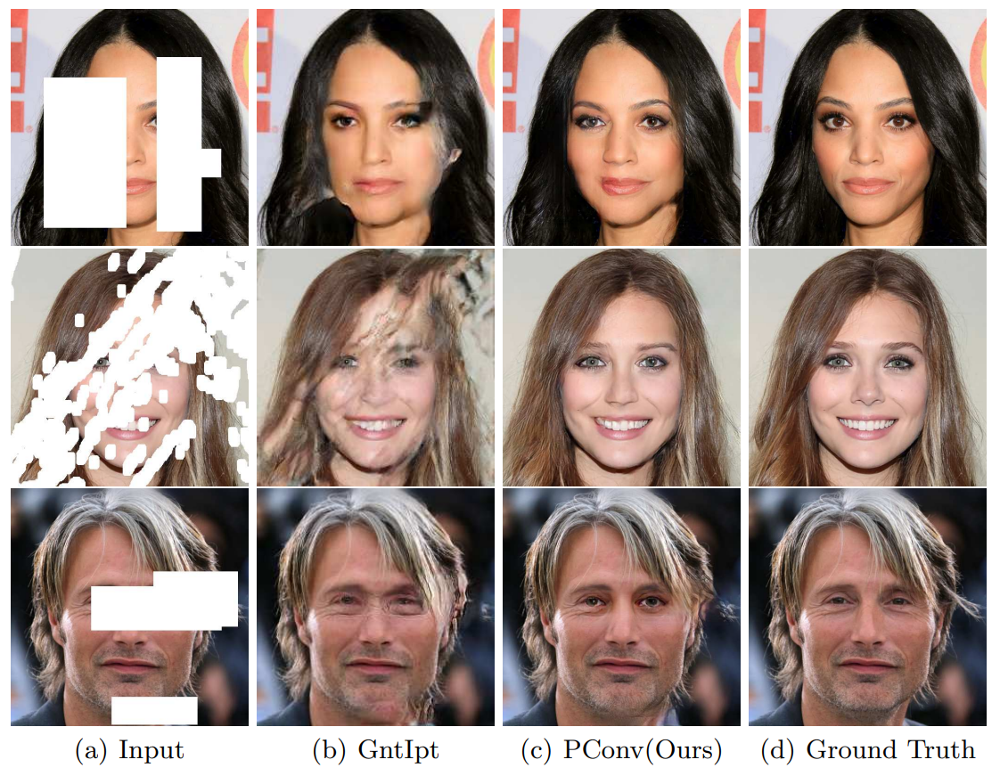
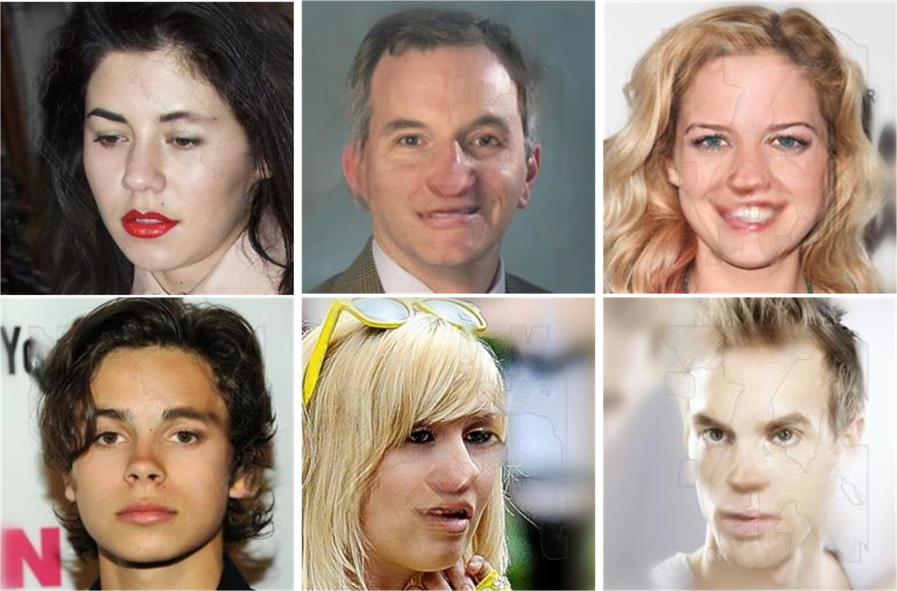
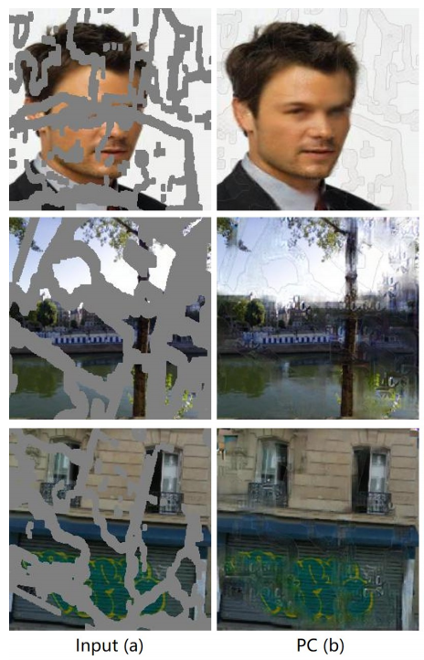
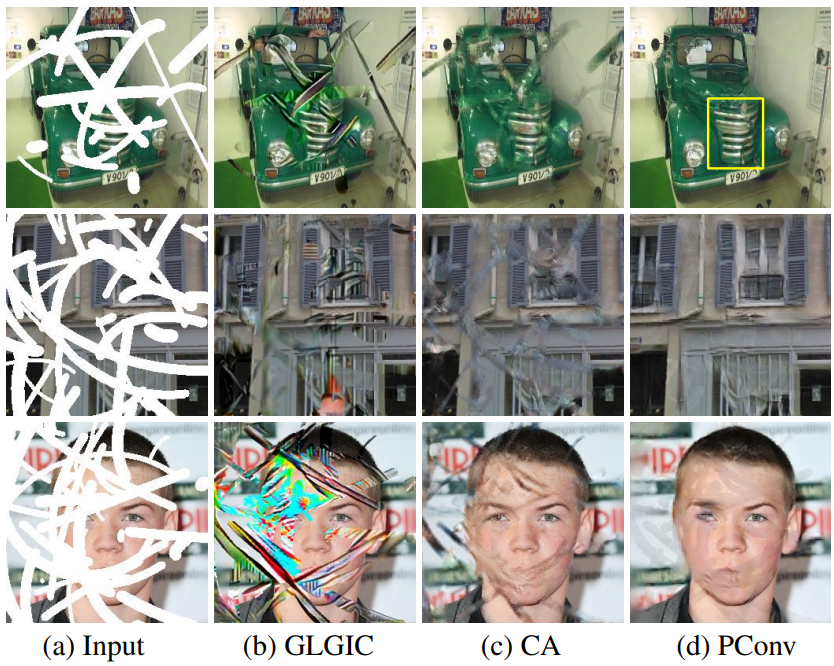

### 2018-eccv Image Inpainting for Irregular Holes Using Partial Convolutions PaddlePaddle版本复现

这次复现主要参考了原论文和两个pytorch版本的源码：

**官方源码**：https://github.com/NVIDIA/partialconv

**非官方源码**：https://github.com/naoto0804/pytorch-inpainting-with-partial-conv

因为官方源码把两篇论文的方法写在一起了，比较乱，所以只参考了PartialConv的实现部分。

**原文中的效果**：



其中第三列是论文中展示的效果，但其实自己复现的效果并没有这么优秀，下面是我用非官方版pytorch复现的效果（从左到右三列所用的mask面积依次是0.1-0.2，0.2-0.3，0.3-0.4的）：



当时训练是batchsize为4，迭代了50万次，因为celeba_hq的训练集有3万张图片，大概就是66个epoch，之后又微调了50万次迭代。效果其实并没有论文那么好（只能说作者太会挑图了）。此外也有几篇其他有关image inpainting的论文做了和PartialConv的对比试验，他们的复现效果如下：

下图是ICCV2019 Coherent Semantic Attention for Image Inpainting对PC做的复现



下图是IJCAI 2019 Coarse-to-Fine Image Inpainting via Region-wise Convolutions and Non-Local Correlation对PC的复现结果（其中第四列是PC的效果）：


可以看出在celeba的表现上都不是特别好。

下面是我的paddlepaddle版本对pc的复现，下面是没有微调的效果，微调后效果可能会进一步提升。

**视觉效果**：

这里我做测试的时候，随机从irregular mask数据集（1.2w张mask图片）中进行选择，对测试集进行修复：


**与非官方版以及官方版的Place2数据集的对比：**

​	因为官方版没有给出预训练的checkpoints，而非官方版又只给出了place2的预训练模型，所以除了celeba的视觉效果展示外，我又训练了一版place2的预训练模型进行对比。下面是分别在mask区域占10-20%，20-30%和30-40%的视觉效果和指标对比。因为官方版没有预训练模型，就只和非官方版进行了视觉效果对比。

**指标：**

下表是指标的对比，其中paper代表的是原论文中展示的指标效果，un-pytorch展示的是非官方的预训练模型的指标效果，our-paddle是我用paddle版本复现的效果。(PSNR和SSIM是越高越好,L1是越低越好)


**视觉对比：**

下面三张图分别是我随机选了10-20%，20-30%和30-40%的mask各一张进行视觉对比。其中每张图的第一行是input，第二行是mask，第三行是非官方版的效果，第四行是paddle复现的效果，第五行是ground truth。关于测试图片，我也没有挑图，直接选取了测试集的前24张图分成三类，用三种mask处理来进行修复。

mask:10-20%，测试集图片：第1-8张


mask:20-30%，测试集图片：第9-16张


mask:30-40%，测试集图片：第17-24张


**训练方法：**

```
train.py
```

**测试方法：**

```
test.py
```

**预训练模型：**

这个是在celeba数据集下，lr=0.0002训练了60w个iterate的结果，个人感觉再改变学习率微调会进一步提升效果

链接：https://pan.baidu.com/s/1h6EQGLaHnrroZo91uTJXBw 
提取码：pdpd

这个是在Places2数据集下，lr=0.0002训练了60w个iterate的结果，个人感觉再改变学习率微调会进一步提升效果

链接：https://pan.baidu.com/s/1INLUYXRpJD_ywlPzH3IUGQ 
提取码：pdpd

**训练日志：**

这里我用了paddlepaddle的visualDL来记录自己的日志，查看方法：

```
visualdl --logdir ./logs/Celeba
```

```
visualdl --logdir ./logs/Place
```

