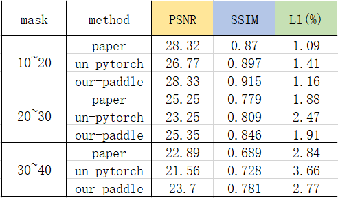
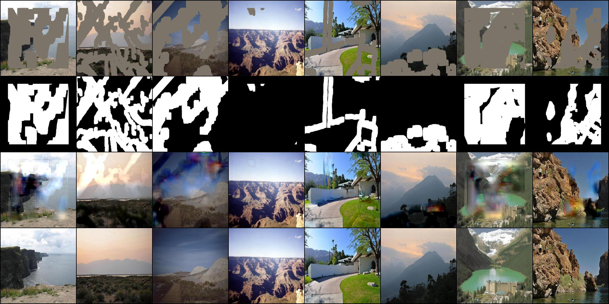
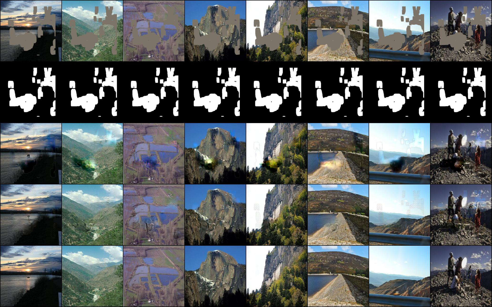
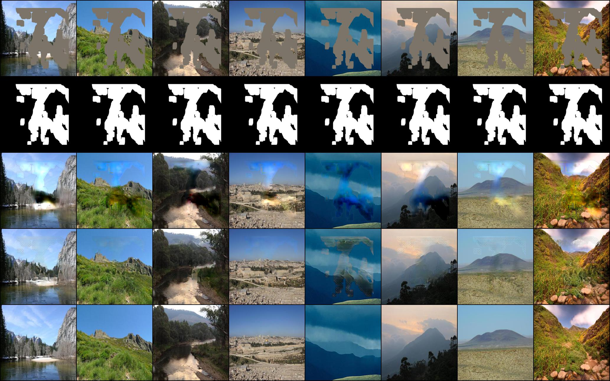

# Paddle_T2I

this is a paddle repo of Image Inpainting for Irregular Holes Using Partial Convolutions 

English | [简体中文](./README_cn.md)

   * [Paddle_PConv]
     * [1 Introduction](#1-introduction)
     * [2 Accuracy](#2-accuracy)
     * [3 Dataset](#3-dataset)
     * [4 Environment](#4-environment)
     * [5 Quick start](#5-quick-start)
       * [step1:clone](#step1clone)
       * [step2:Training](#step2Training)
       * [step3:Test](#step3Test)
       * [Prediction using pre training model](#prediction-using-pre-training-model)
     * [6 Code structure](#6-code-structure)
       * [6.1 structure](#61-structure)
       * [6.2 Parameter description](#62-parameter-description)
       * [6.3 Training](#63-training)
       * [6.4 Evaluation and Test](#64-evaluation-and-test)
     * [7 Model information](#7-model-information)

## 1 Introduction

This project is based on the paddlepaddle framework to reproduce PartialConv, a 2018 ECCV article on image restoration, where the main approach is to incrementally restore images by updating the strategy of mask. In addition the authors provide a dataset of non-regularmask, about 1.2w mask images.

**Paper:**

- [1] Liu G, Reda F A, Shih K J, et al. Image inpainting for irregular holes  using partial convolutions[C]//Proceedings of the European Conference on Computer Vision (ECCV). 2018: 85-100.

**Reference project：**

- **Official**：https://github.com/NVIDIA/partialconv
- **Unofficial**：https://github.com/naoto0804/pytorch-inpainting-with-partial-conv

## 2 Accuracy

The acceptance criteria for this project are the images generated by human eye evaluation on the Celeba-HQ dataset, because there are not enough images in the paper, so it was changed again to compare the metrics on places2: The following table shows the comparison of the metrics, where paper represents the effect of the metrics shown in the original paper, un-pytorch shows the effect of the metrics of the unofficial pre-trained model, our- paddle is the effect that I reproduced with the paddle version. (PSNR and SSIM are the higher the better, L1 is the lower the better)



Visual results: the first line of each image is input, the second line is mask, the third line is the unofficial version of the effect, the fourth line is the effect of paddle reproduction, and the fifth line is ground truth.

| Dataset |         maskratio:10-20         |         maskratio:20-30          |         maskratio:30-40         |
| :-----: | :-----------------------------: | :------------------------------: | :-----------------------------: |
| Places2 |  |  |  |

Visual results for CelebA-HQ datasets

Here I do the test by randomly selecting from the irregular mask dataset (1.2w mask images) to fix the test set


## 3 Datasets

[Celeba-HQ](http://mmlab.ie.cuhk.edu.hk/projects/CelebA.html)+[Places2](http://places2.csail.mit.edu/)

### Datasets Size:

  - Train+Validation：respective 29000 and 10000.
  - Test：respective 1000 and 100.

## 4 Environment

- Hardware：GPU、CPU

- Framwork：
  - PaddlePaddle >= 2.0.0

## 5 Quick start

### step1:clone

```bash
git clone https://github.com/maruru-hub/PartialConv-paddle.git
cd PartialConv-paddle
```

### step2:Training

```
python main.py 
```

### step3:Test

Save the parameters of the model in ```model\```, then change the value of pretrain_model, and then run the following command to save the output image in the ```image\``` directory

```
python test.py
```

### Prediction using pre training model

Place the files to be tested in the directory determined by the parameter pretrain_model, modify the option.py file, and run the following command

```
python main.py 
```

## 6 Code structure

### 6.1 structure

Because the acceptance of this project is through the human eye to observe the image, i.e. user_study, the evaluation is the same way as the prediction

```
├─datasets                                         
├─logs                                                 
├─image                                             
├─checkpoints                                         
├─model                                              
|  Decoder.py                                         
|  Encoder.py                                        
|  discriminator.py                                 
|  PartialConv2d.py                                 
|  loss.py                                         
|  base_model.py                                  
│  README.md                                     
│  README_cn.md                                     
│  train.py                                           
│  test.py                                              
│  dataprocess.py                                       
│  options.py    
```

### 6.2 Parameter description

Training and evaluation-related parameters can be set in `main.py`, as follows.

```bash
python main.py --split=0
```

| Parameters       | default    | description    | other                  |
| ---------------- | ---------- | -------------- | ---------------------- |
| batchSize        | 4          | 加载数据批量   |                        |
| g_lr             | 0.0002     | 生成器参数     | 可以随着训练的进行递减 |
| d_lr             | 0.0002     | 判别器参数     |                        |
| --pretrain_model | None, 可选 | 预训练模型路径 |                        |
| ### 6.3 train    |            |                |                        |

```bash
python main.py
```

#### 训练输出

#### Training output

After the execution of training starts, the training content will be displayed through visualDL, and the log file will be viewed through the following code

```text
visualdl --logdir ./logs/Celeba
visualdl --logdir ./logs/Place
```

### 6.4 Evaluation and Test

Our pre-trained model is as follows.
This is the result of training 60w iterates under the CelebA-HQ dataset with lr=0.0002

Link:https://pan.baidu.com/s/1h6EQGLaHnrroZo91uTJXBw 

Extraction Code:pdpd

This is the result of training 60w iterates under the Places2 dataset with lr=0.0002

Link:https://pan.baidu.com/s/1INLUYXRpJD_ywlPzH3IUGQ 

Extraction Code:pdpd

```bash
python main.py --validation --split=2 --pretrain_model=model/netG.pdparams
```

## 7 Model information

For other information about the model, please refer to the following table:

| information           | description      |
| --------------------- | ---------------- |
| Author                | Lin Sun          |
| Date                  | 2021.09          |
| Framework version     | Paddle 2.0.2     |
| Application scenarios | Image Inpainting |
| Support hardware      | GPU、CPU         |

# Log

```
visualdl --logdir ./logs/Celeba
visualdl --logdir ./logs/Place
```

# Results

Visual results: the first line of each picture is input, the second line is mask, the third line is the unofficial version of the effect, the fourth line is the effect of paddle reproduction, and the fifth line is ground truth.

| Dataset |         maskratio:10-20         |         maskratio:20-30          |         maskratio:30-40         |
| :-----: | :-----------------------------: | :------------------------------: | :-----------------------------: |
| Places2 |  |  |  |
